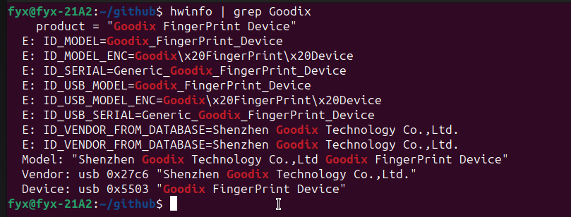

### ubuntu安装汇顶指纹识别驱动

手上有部Think book 14的笔记本，带有Goodix的指纹识别设备。

安装ubuntu23.04后，在Settings--User中未找到指纹功能，使用fwupdmgr get-devices命令也未找到有关Goodix的设备。


开启Fingerprint authentication也无法使用。
```
sudo pam-auth-update 
```


使用hwinfo，找到了 Goodix设备，但是设备是5503的

```
sudo apt install hwinfo
hwinfo | grep Goodix
```


### Goodix FingerPrint Driver 550a驱动安装

查阅资料只找到Goodix FingerPrint Driver 550a的设备才可以使用的驱动：

https://support.lenovo.com/us/en/downloads/ds560884-goodix-fingerprint-driver-for-linux-thinkpad-e14-gen-4-e15-gen-4

驱动下载：
https://download.lenovo.com/pccbbs/mobiles/r1slg01w.zip

Goodix FingerPrint Driver 550a驱动使用说明：

```
DETERMINING THE FINGERPRINT READER OF YOUR SYSTEM:

   1. Before driver installation, check your fingerprint reader.
      $ sudo apt install hwinfo
      $ hwinfo | grep 550a
      ## Example outputs ##
      Device: usb 0x550a "Goodix:Fingerprint"
   2. The fingerprint device PID should be 0x550a.


-------------------------------------------------------------------------------------
INSTALLATION INSTRUCTIONS

   1. Install Ubuntu 20.04/22.04.
   2. Configure the environment before test
       $ sudo add-apt-repository ppa:andch/staging-fprint
       $ sudo apt update
       $ sudo apt install libfprint-2-2
   3. Install the deb.
       $ sudo dpkg -i libfprint-2-tod-goodix_amd64.deb
   4. Reboot 
   5. Enroll fingerprint.
   6. Verify fingerprint.
```
